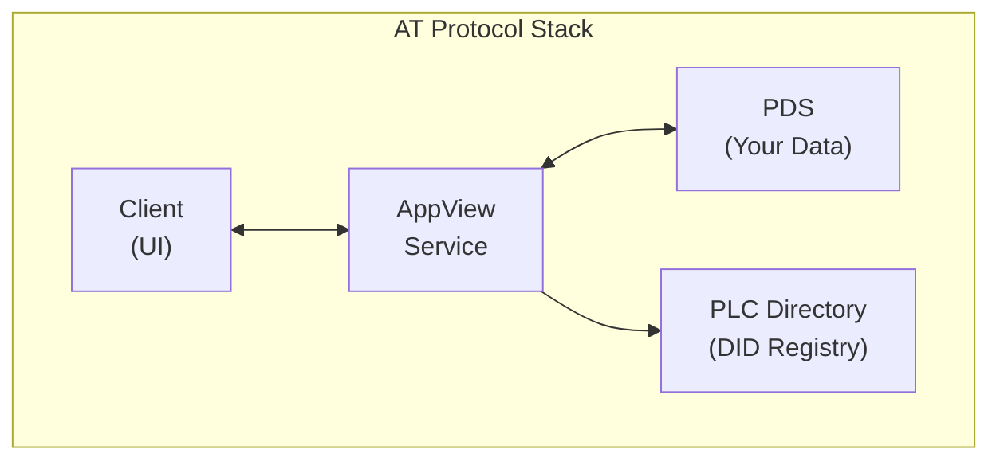

# Architecture Documentation

Understanding the architecture of the Bluesky Private Profile Integration project and the AT Protocol.

## Overview

This project integrates multiple components to extend Bluesky with private profile functionality:

- **Bluesky App** - Frontend user interface
- **Personal Data Server (PDS)** - User data storage and management
- **AppView Service** - Social aggregation layer
- **Pinata Integration** - Private gateway service for media
- **Custom Lexicons** - Extended AT Protocol schemas

## Documentation

- **[System Overview](overview.md)** - Overall system architecture and component organization
- **[AT Protocol](at-protocol.md)** - Core AT Protocol concepts and architecture
- **[Component Interaction](components.md)** - How components communicate and work together
- **[Access Control](access-control.md)** - Private profile access control architecture and implementation

## Key Concepts

### Distributed Architecture

The AT Protocol uses a distributed architecture where:

- **Users own their data** via Personal Data Servers
- **Applications aggregate data** via AppView services
- **Identity is portable** via DIDs (Decentralized Identifiers)
- **Content is addressable** via AT URIs

### Component Roles



### Private Profile Extension

The private profile feature extends this architecture with:

1. **Privacy Settings** - Stored in PDS preferences (`app.bsky.actor.defs#privateProfilePref`)
2. **Follow Requests** - Managed via `app.bsky.graph.followRequest` records
3. **Access Control** - Enforced by PDS using follow-based authorization
4. **Private Media** - Routed through Pinata gateways with token-based access
5. **Custom Lexicons** - Define new record types and extend AT Protocol schemas

**See [Access Control Documentation](access-control.md) for detailed implementation.**

## Repository Structure

```
bsky-private-profile/               # Orchestrator repository
├── bluesky-app/                    # Frontend (React Native)
├── atproto/                        # Backend (PDS + AppView)
│   └── packages/
│       ├── pds/                    # Personal Data Server
│       └── bsky/                   # AppView service
├── community-stream-lexicon/       # Custom lexicon definitions
├── pinata-integration/             # Gateway service
└── official-pds/                   # Docker PDS distribution
```

## Development Workflow

1. **Frontend Changes** - Made in `bluesky-app/`
2. **Backend Logic** - Modified in `atproto/packages/pds/`
3. **New Records** - Defined in `community-stream-lexicon/`
4. **Private Media** - Handled by `pinata-integration/`

## Next Steps

1. Read [System Overview](overview.md) for detailed architecture
2. Learn [AT Protocol concepts](at-protocol.md) for understanding the foundation
3. See [Component Interaction](components.md) for implementation details
4. Review [Access Control](access-control.md) for private profile security architecture

---

**Note:** Understanding the architecture helps you navigate the codebase and make informed development decisions.
