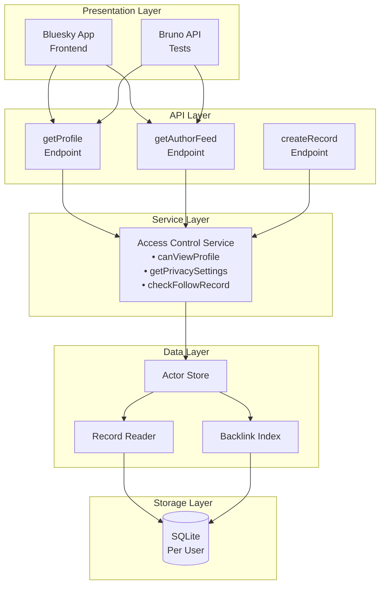
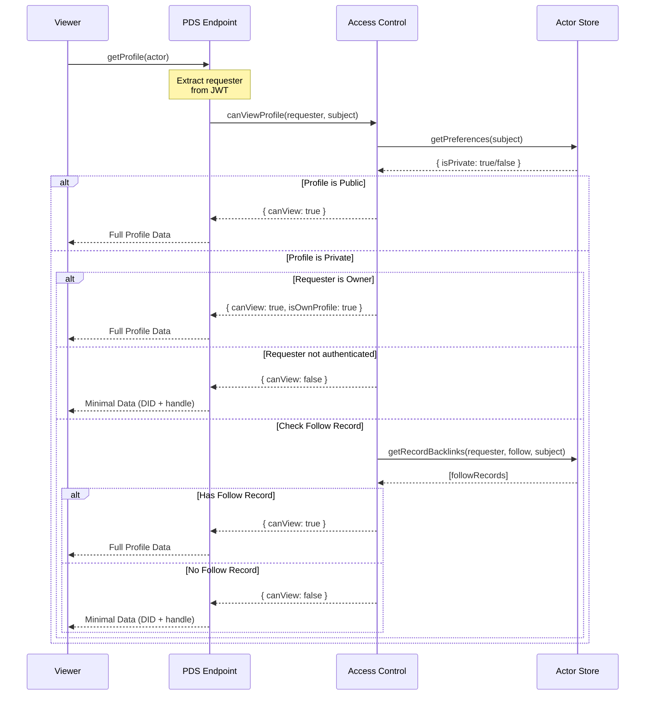
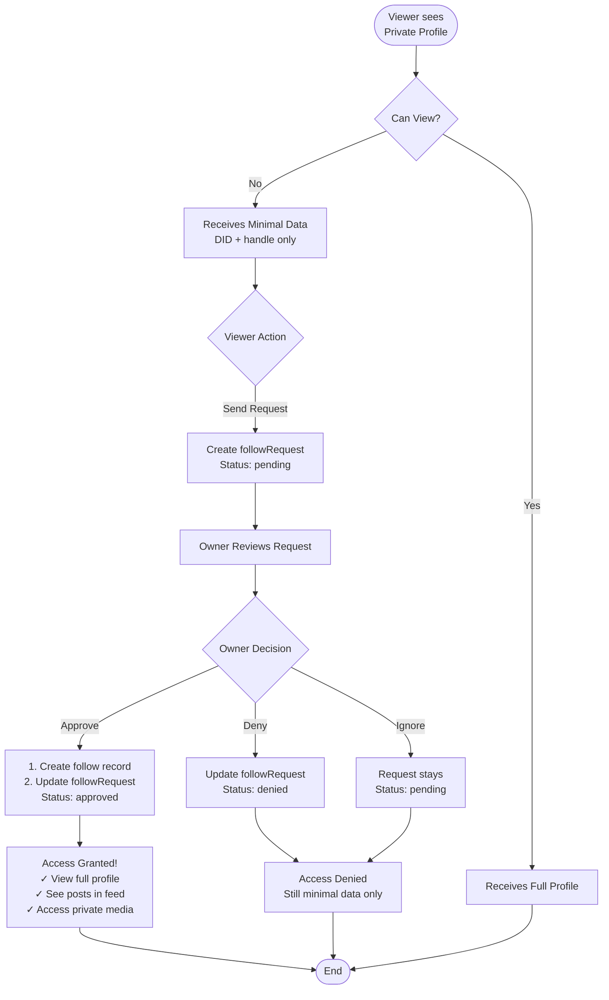
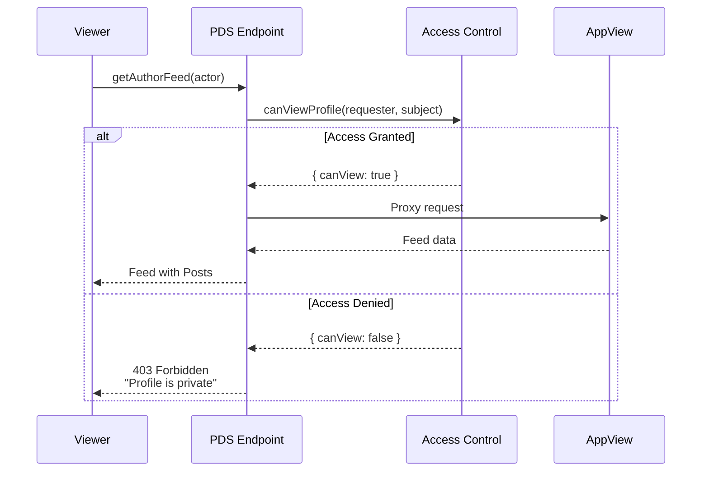
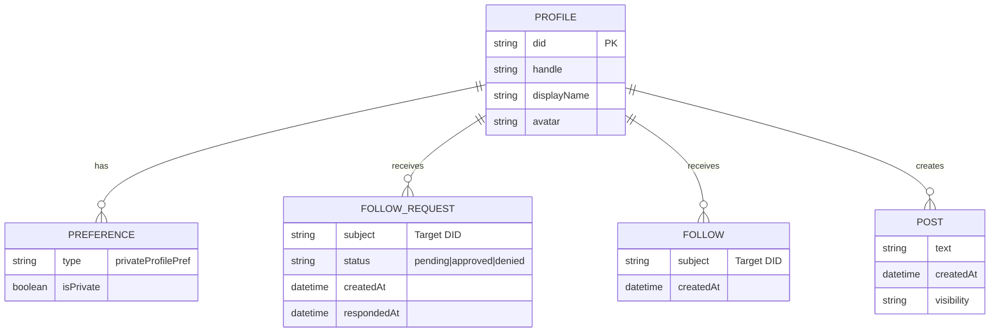
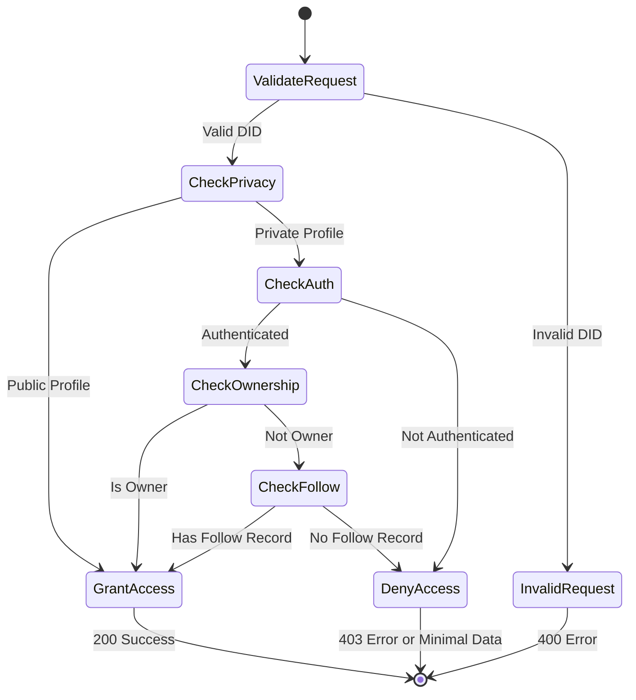

# Access Control Architecture

Comprehensive documentation of the private profile access control system implementation.

## Overview

The access control system implements fine-grained authorization for AT Protocol profiles, allowing users to restrict who can view their content. This document details the architecture, data flows, and implementation of Phase 2.1: Read Access Control.

## Table of Contents

- [System Architecture](#system-architecture)
- [Access Control Flow](#access-control-flow)
- [Component Details](#component-details)
- [Data Model](#data-model)
- [Error Handling](#error-handling)
- [Security Model](#security-model)
- [Implementation Guide](#implementation-guide)
- [Testing Strategy](#testing-strategy)

---

## System Architecture

### Layer Architecture

The access control system follows a layered architecture pattern:



### Key Design Principles

1. **Privacy by Design** - Profiles can be marked private via user preferences
2. **Follow-Based Authorization** - Access granted based on `app.bsky.graph.follow` records
3. **Minimal Data Exposure** - Unauthorized viewers only see handle and DID
4. **Owner Override** - Profile owners always have full access to their own content
5. **Efficient Queries** - Uses backlink indices for O(log n) permission checks

---

## Access Control Flow

### Private Profile Access Check

Complete flow when a viewer requests a private profile:



### Follow Request Approval Process

How follow requests integrate with access control:



### Feed Access Control

Feed access uses the same authorization but returns 403 errors instead of minimal data:



---

## Component Details

### Access Control Service

**Implementation:** [`/atproto/packages/pds/src/services/access-control.ts`](../../atproto/packages/pds/src/services/access-control.ts)

**Class:** `AccessControlService`

**Public API:**

- `canViewProfile(requester, subject)` - Main authorization check
- `getPrivacySettings(did)` - Retrieves privacy settings

**Private Helpers:**

- `checkFollowRecord(requester, subject)` - Checks for follow relationship

**Key Methods:**

#### `canViewProfile(requester, subject)`

Main authorization check method.

**Parameters:**

- `requester`: DID of requesting user (null if unauthenticated)
- `subject`: DID of profile being accessed

**Returns:**

```typescript
{
  canView: boolean,      // Can the requester view this profile?
  isPrivate: boolean,    // Is the profile private?
  isOwnProfile: boolean  // Is requester viewing their own profile?
}
```

**Logic Flow:**

1. Query subject's privacy settings
2. If public → grant access
3. If private → check if requester is owner
4. If not owner → check if requester is authenticated
5. If authenticated → check for follow record via backlinks
6. Return access decision

**Performance:** O(log n) due to indexed backlink queries

#### `getPrivacySettings(did)`

Retrieves privacy preferences for a user.

**Returns:**

```typescript
{
  isPrivate: boolean;
}
```

**Implementation:**

- Queries `app.bsky.actor.defs#privateProfilePref` from preferences
- Defaults to `false` if preference not found
- Handles errors gracefully (returns public if user doesn't exist)

#### `checkFollowRecord(requester, subject)` (Private)

Checks if a follow relationship exists.

**Implementation:** See `checkFollowRecord()` method in [`access-control.ts`](../../atproto/packages/pds/src/services/access-control.ts)

Uses `actorStore.read()` with `store.record.getRecordBacklinks()` to query for follow records efficiently.

**Why Backlinks?**

- O(log n) lookup time using database indices
- No need to scan entire collection
- Scales efficiently with large follower counts
- Leverages AT Protocol's built-in indexing

### Modified Endpoints

#### getProfile Endpoint

**Implementation:** [`/atproto/packages/pds/src/api/app/bsky/actor/getProfile.ts`](../../atproto/packages/pds/src/api/app/bsky/actor/getProfile.ts)

**Key Changes:**

- Instantiates `AccessControlService`
- Uses `authorizationOrAdminTokenOptional` (supports unauthenticated requests)
- Resolves actor DID from handle or DID parameter
- Calls `canViewProfile()` before proxying to AppView
- Returns minimal profile data for unauthorized viewers

**Minimal Profile Response Format:**

When unauthorized, only `did` and `handle` are returned (see implementation for exact structure).

**Design Rationale:**

- Confirms profile exists (avoids 404-based enumeration)
- Provides enough info to send follow request
- Prevents information leakage about posts, followers, etc.

#### getAuthorFeed Endpoint

**Implementation:** [`/atproto/packages/pds/src/api/app/bsky/feed/getAuthorFeed.ts`](../../atproto/packages/pds/src/api/app/bsky/feed/getAuthorFeed.ts)

**Key Changes:**

- Instantiates `AccessControlService`
- Uses `authorizationOrAdminTokenOptional`
- Resolves actor DID and calls `canViewProfile()` before proxying
- Throws `ForbiddenError` with message "Profile is private" for unauthorized viewers

**Error Response:** 403 Forbidden with error message (see implementation for exact error structure)

### AppContext Integration

**Implementation:** [`/atproto/packages/pds/src/context.ts`](../../atproto/packages/pds/src/context.ts)

**Added Helper Methods:**

- `canViewProfile(requester, subject)` - Convenience wrapper for access checks
- `getPrivacySettings(did)` - Convenience wrapper for privacy settings retrieval

These methods dynamically import `AccessControlService` and provide easy access throughout the codebase without circular dependencies.

**Usage Example:** See any endpoint handler that performs access control checks, such as `getProfile.ts` or `getAuthorFeed.ts`.

---

## Data Model

### Privacy Preferences

**Collection:** User preferences (not a separate collection)
**Type:** `app.bsky.actor.defs#privateProfilePref`

**Schema:**

```typescript
{
  $type: "app.bsky.actor.defs#privateProfilePref",
  isPrivate: boolean
}
```

**Storage:**

- Stored in Actor Store per user
- Retrieved via PreferenceReader
- Persisted in SQLite

**Example:**

```json
{
  "$type": "app.bsky.actor.defs#privateProfilePref",
  "isPrivate": true
}
```

### Follow Records

**Collection:** `app.bsky.graph.follow`
**Type:** `app.bsky.graph.follow`

**Schema:**

```typescript
{
  $type: "app.bsky.graph.follow",
  subject: string,    // DID being followed
  createdAt: string   // ISO 8601 timestamp
}
```

**Storage:**

- Stored in requester's repository
- Indexed via backlinks on `subject` field
- AT URI format: `at://requester.did/app.bsky.graph.follow/rkey`

**Backlink Index:**

- Automatically maintained by ActorStore
- Enables efficient reverse lookups
- Used to find "who follows subject DID?"

### Follow Request Records

**Collection:** `app.bsky.graph.followRequest`
**Type:** `app.bsky.graph.followRequest`

**Schema:**

```typescript
{
  $type: "app.bsky.graph.followRequest",
  subject: string,      // DID being requested
  status: "pending" | "approved" | "denied",
  createdAt: string,
  respondedAt?: string  // Set when approved/denied
}
```

**Usage:**

- Created by viewer wanting to follow private profile
- Updated by profile owner to approve/deny
- On approval, `app.bsky.graph.follow` record is created
- Status tracked for UI display

### Entity Relationship Diagram



---

## Error Handling

### Error Types

| Error Type         | Status Code | When It Occurs               | Response Body                                           |
| ------------------ | ----------- | ---------------------------- | ------------------------------------------------------- |
| **ForbiddenError** | 403         | Unauthorized feed access     | `{ error: "Forbidden", message: "Profile is private" }` |
| **Not Found**      | 404         | Profile doesn't exist        | Standard 404 response                                   |
| **InvalidRequest** | 400         | Malformed DID/parameters     | `{ error: "InvalidRequest", message: "..." }`           |
| **AuthRequired**   | 401         | Auth needed but not provided | `{ error: "AuthRequired", message: "..." }`             |

### Error Flow State Machine



### Error Handling Best Practices

**For getProfile:**

- Never return 404 for private profiles (prevents enumeration)
- Return minimal data instead of error
- Allows clients to detect private status and show appropriate UI

**For getAuthorFeed:**

- Return 403 Forbidden for unauthorized access
- Clear error message: "Profile is private"
- Allows clients to show follow request UI

**For Authentication Errors:**

- Return 401 when auth is required but missing
- Distinguish between "not authenticated" and "not authorized"

---

## Security Model

### Authentication

**JWT-Based Authentication:**

- Access tokens short-lived (minutes)
- Refresh tokens long-lived (days/weeks)
- DID extracted from validated JWT
- Optional auth for profile views (supports discovery)

**Token Validation:**

```typescript
const requester = auth?.credentials?.did ?? null;
```

### Authorization Checks

**Three-Level Check:**

1. **Privacy Level**: Is profile private?
2. **Ownership Level**: Is viewer the owner?
3. **Relationship Level**: Does follow relationship exist?

**Check Order Matters:**

- Owner check before relationship check (performance)
- Privacy check first (early exit for public profiles)
- Unauthenticated check prevents null pointer issues

### Information Disclosure

**Minimal Data Principle:**

- Only expose DID and handle for unauthorized access
- No metadata about:
  - Post count
  - Follower count
  - Following count
  - Profile description
  - Avatar/banner URLs
  - Creation date

**Why Confirm Existence?**

- Prevents user enumeration attacks via 404s
- Allows legitimate follow request flows
- Maintains user discoverability for valid use cases

### Attack Prevention

**Timing Attacks:**

- Consistent response time regardless of path taken
- Database queries optimized to similar performance

**Enumeration Prevention:**

- No 404s for private profiles
- Same response structure for all unauthorized access
- No hints about follower counts or relationships

**Rate Limiting:**

- Standard PDS rate limiting applies
- Access checks are fast (indexed queries)
- No additional throttling needed

---

## Implementation Guide

### Adding Access Control to New Endpoints

**Reference Implementation:** See [`getProfile.ts`](../../atproto/packages/pds/src/api/app/bsky/actor/getProfile.ts) or [`getAuthorFeed.ts`](../../atproto/packages/pds/src/api/app/bsky/feed/getAuthorFeed.ts)

**Steps:**

1. Import `AccessControlService` from `../../../../services/access-control`
2. Instantiate with `new AccessControlService(ctx.actorStore)` in the handler
3. Extract requester DID from auth credentials (null if unauthenticated)
4. Call `canViewProfile(requester, targetDid)`
5. Handle result:
   - For profile endpoints: return minimal data if unauthorized
   - For content endpoints: throw `ForbiddenError` if unauthorized

**Simpler Approach:** Use `ctx.canViewProfile(requester, subject)` helper method (no import needed)

### Performance Considerations

**Backlink Query Performance:**

- O(log n) lookup time
- Uses SQLite B-tree index
- Typically < 10ms even with 10k+ follows

**Caching Strategy (Future Enhancement):**

Not currently implemented. When needed, add LRU cache for frequently accessed profiles with ~5 minute TTL. See [`access-control.ts`](../../atproto/packages/pds/src/services/access-control.ts) to add caching layer.

---

## Testing Strategy

### Unit Tests

**Implementation:** [`/atproto/packages/pds/tests/access-control.test.ts`](../../atproto/packages/pds/tests/access-control.test.ts)

**Test Coverage:**

The test suite includes comprehensive coverage of:

1. **Privacy Settings Retrieval** - Default behavior, reading private flag, handling missing data
2. **Access Control Decisions** - All permission combinations (owner, follower, unauthorized, public)
3. **Follow Record Checking** - Detection via backlink indices
4. **Profile Transitions** - Access changes when privacy or follows change
5. **Edge Cases** - Null requesters, non-existent profiles, concurrent access
6. **Endpoint Integration** - Both `getProfile` and `getAuthorFeed` endpoints

See the test file for complete test scenarios and assertions.

### Bruno API Tests

**Location:** [`/bruno-api/Access Control/`](../../bruno-api/Access%20Control/)

**Test Files:**

1. [`Check Private Profile Access.bru`](../../bruno-api/Access%20Control/Check%20Private%20Profile%20Access.bru) - Profile viewing with different access levels, validates minimal vs full data
2. [`View Private Profile Feed.bru`](../../bruno-api/Access%20Control/View%20Private%20Profile%20Feed.bru) - Feed access authorization and 403 error validation
3. [`Get Other Privacy Settings.bru`](../../bruno-api/Privacy%20Settings/Get%20Other%20Privacy%20Settings.bru) - Privacy setting visibility (updated)

**Test Scenarios:**

```
Scenario 1: Public Profile Access
1. Create account (Alice) - public
2. Bob views Alice's profile
3. ✓ Full profile data returned

Scenario 2: Private Profile - Owner Access
1. Alice sets profile to private
2. Alice views own profile
3. ✓ Full profile data returned

Scenario 3: Private Profile - Unauthorized
1. Alice has private profile
2. Bob (no follow) views Alice's profile
3. ✓ Minimal data returned (handle + DID only)

Scenario 4: Private Profile - Approved Follower
1. Alice has private profile
2. Bob creates follow record for Alice
3. Bob views Alice's profile
4. ✓ Full profile data returned

Scenario 5: Feed Access - Unauthorized
1. Alice has private profile with posts
2. Bob tries to view Alice's feed
3. ✓ 403 Forbidden error returned
```

### Performance Testing

**Benchmark Targets:**

- Access check: < 50ms (p95)
- Backlink query: < 10ms (p95)
- Profile endpoint: < 200ms total (p95)

**Load Testing:**

```bash
# Test concurrent access checks
ab -n 1000 -c 10 http://localhost:2583/xrpc/app.bsky.actor.getProfile?actor=alice.test
```

---

## Future Enhancements

### Phase 3: Granular Permissions

**Status:** Not yet implemented

**Planned Features:**

- Follower groups (close friends, acquaintances)
- Per-content visibility controls
- Time-limited access grants

**Implementation:** Will extend `AccessControlService` with group management methods

### Phase 4: Performance Optimization

**Status:** Not yet implemented

**Planned Features:**

- Redis-based caching layer for access decisions
- Batch access check methods for feed generation
- Response time optimization

**Implementation:** Will add caching wrapper around `AccessControlService`

### Phase 5: Advanced Features

**Status:** Not yet implemented

**Planned Features:**

- Time-limited access grants
- Temporary visibility boosts
- Privacy analytics for profile owners
- Auto-approval rules based on criteria

**Implementation:** TBD - requires design phase

---

## References

### Implementation Files

- **Access Control Service:** `/atproto/packages/pds/src/services/access-control.ts`
- **getProfile Endpoint:** `/atproto/packages/pds/src/api/app/bsky/actor/getProfile.ts`
- **getAuthorFeed Endpoint:** `/atproto/packages/pds/src/api/app/bsky/feed/getAuthorFeed.ts`
- **AppContext:** `/atproto/packages/pds/src/context.ts`
- **Test Suite:** `/atproto/packages/pds/tests/access-control.test.ts`
- **Bruno Tests:** `/bruno-api/Access Control/`

### Related Documentation

- [System Overview](overview.md) - Overall architecture
- [Component Interaction](components.md) - How components communicate
- [AT Protocol](at-protocol.md) - Protocol fundamentals

### External Resources

- [AT Protocol Specification](https://atproto.com/)
- [Lexicon Documentation](https://atproto.com/lexicons/)
- [Repository Structure](https://atproto.com/specs/repository)
- [Authentication Guide](https://atproto.com/specs/xrpc#authentication)

---

**Last Updated:** Phase 2.1 Implementation Complete
**Status:** ✅ Production Ready
