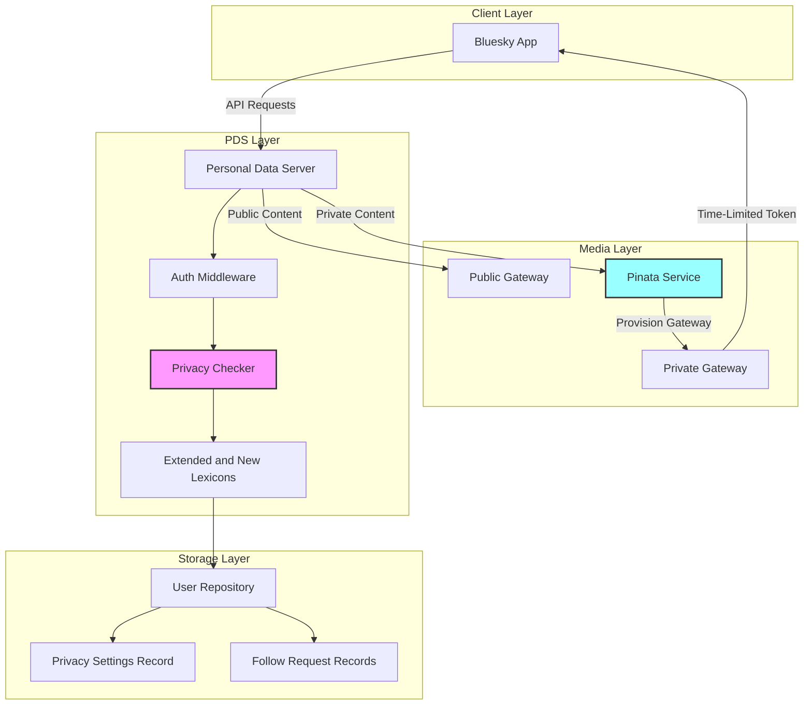
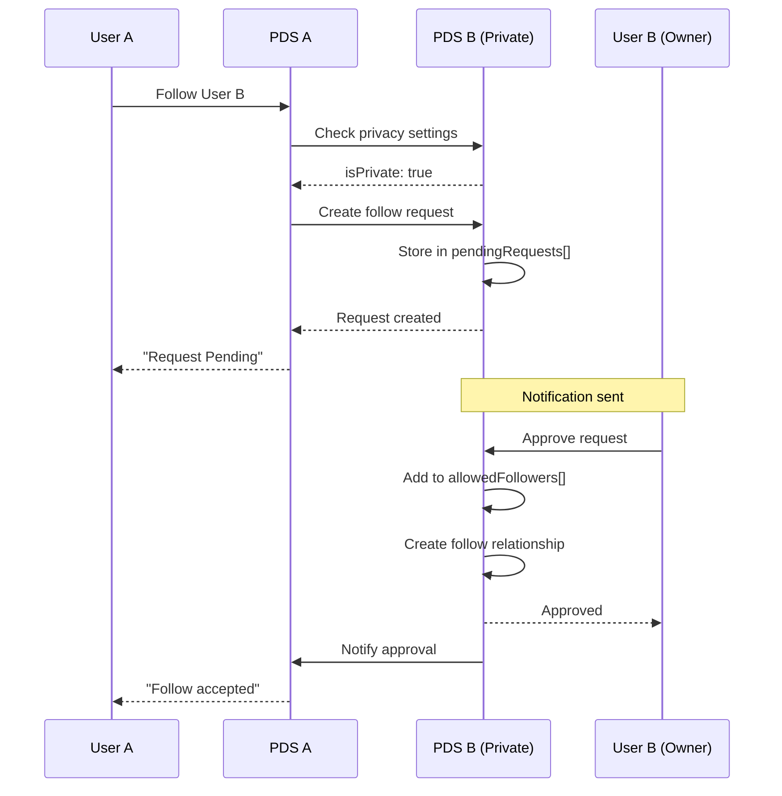
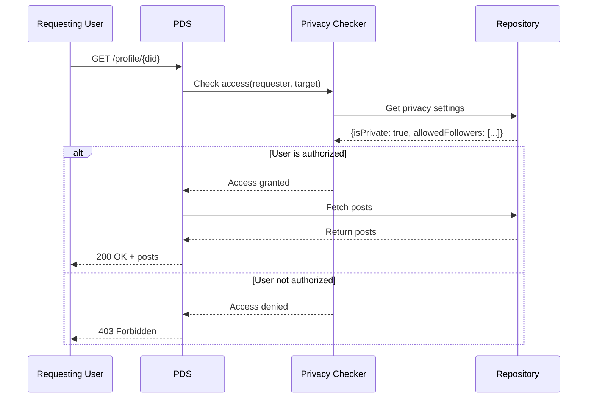
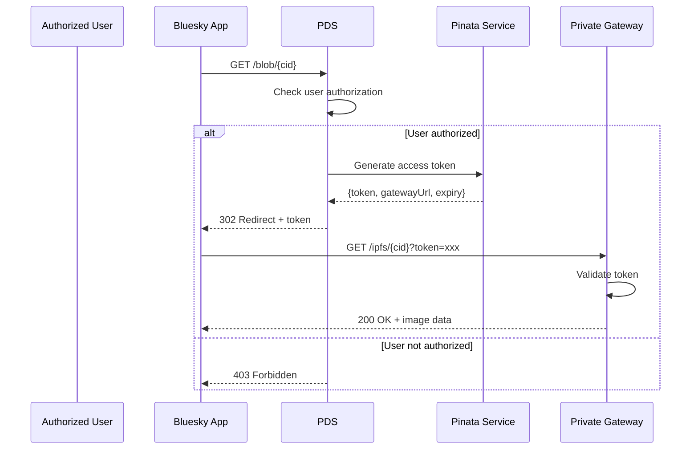

# Private Profiles Implementation Overview

> **For AT Protocol Discussion:** Brief technical overview of PDS-level private profiles with Pinata private gateways

## Summary

We're implementing Instagram-style private profiles for self-hosted PDS instances using:

1. **Extended Privacy Settings and Follow Request/Response Lexicons** - Privacy settings and follow request records in user repositories
2. **PDS Access Control** - Middleware enforcing privacy at the repository level
3. **Pinata Private Gateways** - IPFS gateway access tokens for private media

This approach provides a solution for self-hosters while the official service for private profiles is being built.

## Architecture Components



## Key Data Flows

### 1. Follow Request Flow



### 2. Private Content Access Flow



### 3. Private Media Access Flow



## Extended Privacy Settings and New Follow Request Record Lexicons

### Privacy Settings Record

```typescript
// app.bsky.actor.privacySettings
{
  "lexicon": 1,
  "id": "app.bsky.actor.privacySettings",
  "defs": {
    "main": {
      "type": "record",
      "record": {
        "isPrivate": "boolean",
        "allowedFollowers": ["string"], // DIDs
        "pendingRequests": ["string"]   // DIDs
      }
    }
  }
}
```

### Follow Request Record

```typescript
// app.bsky.graph.followRequest
{
  "lexicon": 1,
  "id": "app.bsky.graph.followRequest",
  "defs": {
    "main": {
      "type": "record",
      "record": {
        "subject": "string",      // DID to follow
        "status": "string",       // pending|approved|denied
        "createdAt": "datetime"
      }
    }
  }
}
```

## API Endpoints

| Endpoint                                | Purpose                           |
| --------------------------------------- | --------------------------------- |
| `app.bsky.actor.setPrivacySettings`     | Toggle profile privacy            |
| `app.bsky.actor.getPrivacySettings`     | Read privacy state                |
| `app.bsky.graph.createFollowRequest`    | Request to follow private profile |
| `app.bsky.graph.listFollowRequests`     | List pending requests (for owner) |
| `app.bsky.graph.respondToFollowRequest` | Approve/deny requests             |

## Implementation Scope

**Target:** Self-hosted PDS instances (Phase 1-4)

**Not included:**

- Federation with main Bluesky network (requires protocol changes)
- E2EE messaging (awaiting Auth Scopes)
- Modifications to public AppView

## Questions for Protocol Team

As a new contributor to the AT Protocol ecosystem, I'd love guidance on making this a successful community effort:

1. **Architecture Review:** Are there any architectural concerns or gotchas I should be aware of with this PDS-level approach? What should I look out for to ensure compatibility with the protocol's evolution?

2. **Migration Path:** When official private data support arrives, what would make my implementation easier to migrate or sunset gracefully? Should I design with any specific compatibility considerations in mind?

3. **Community Coordination:** How can I best coordinate with the official roadmap?

**Goal:** Contribute to the technology and align with the protocol team's needs while providing value for the self-hosted community.

## Full Documentation

- **Roadmap:** [Implementation Phases](https://github.com/CommunityStream-io/bsky-private-profile/blob/main/docs/reference/phases.md)
- **Architecture:** [Full Architecture Docs](https://github.com/CommunityStream-io/bsky-private-profile/tree/main/docs/architecture)
- **Discussion:** [GitHub Issue #38](https://github.com/CommunityStream-io/bsky-private-profile/issues/38)

---

**Note:** This is an interim solution for self-hosters. I'm eager to align with the official protocol design and contribute where helpful.
